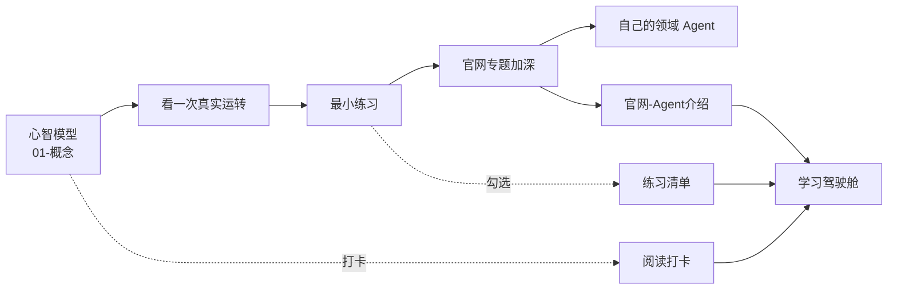

> 打开本库，**先看这一页**。  
> 对我说「**刷新驾驶舱**」，我会按你的打卡和练习勾选重算进度。

## 状态总览

| 指标 | 进度 |
|------|------|
| **综合进度** | `█████░░░░░░░░░░░░░░░░░░░ 20% (20/100)` |
| 阅读打卡 | `░░░░░░░░░░░░░░░░░░░░ 0% (0/37)` |
| 练习清单 | `░░░░░░░░░░░░░░░░░░░░ 0% (0/12)` |
| 官网资料库 | 已入库 **29** 篇专题/导读（库存就绪 ✅） |

**当前阶段：** Phase 1 · 心智模型  
**下一步：** 打开 [[什么是Agent]]，读完后在 [[阅读打卡]] 勾掉它

---

## 今日推荐航线

1. 阅读 → 从 [[阅读打卡]] 挑 **1** 篇未勾笔记  
2. 动手 → [[最小练习清单]] 做 **1** 项，并在 [[日记]] 写 5 行  
3. 对照 → 需要官方说法时打开 [[03-资源/官网-Agent介绍/索引]]

---

## 资料库雷达

| 分区 | 笔记数 | 入口 |
|------|--------|------|
| 概念 | 5 | [[什么是Agent]] 等 |
| 实践 | 2 | [[如何开始学习]] · [[最小练习清单]] |
| OpenAI | 8 | [[OpenAI/01-Agents总览]] |
| Claude | 9 | [[Anthropic-Claude/01-工具调用与Agent循环]] |
| Gemini | 10 | [[Google-Gemini/01-Managed-Agents总览]] |
| 跨厂商 | 2 | [[跨厂商/01-Agent-Skills对照]] |
| 日记 | 1 | `日记/` |

---

## 快捷跳转

| 我想… | 去这里 |
|-------|--------|
| 看路线 | [[Agent学习地图]] |
| 勾阅读 | [[阅读打卡]] |
| 做练习 | [[最小练习清单]] |
| 挖官网 | [[03-资源/官网-Agent介绍/索引]] |
| 写复盘 | 日记/2026-09-16.md（没有就新建） |
| 回首页 | [[欢迎]] |

---

## 和 Agent 怎么玩这一页

把驾驶舱当成**任务看板**：

- 「刷新驾驶舱」→ 我重扫打卡/练习，更新进度条  
- 「我读完了什么是 Agent」→ 我帮你在打卡里勾上，并刷新  
- 「完成 Level 0 第一项」→ 我帮你勾练习清单 + 写日记模板 + 刷新  

---

## 刷新日志

- 2026-09-16 09:50 CST · 驾驶舱首发 · 综合 20% · 阅读 0/37 · 练习 0/12
